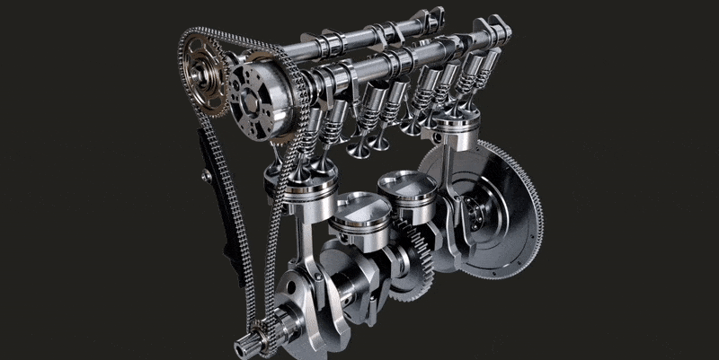
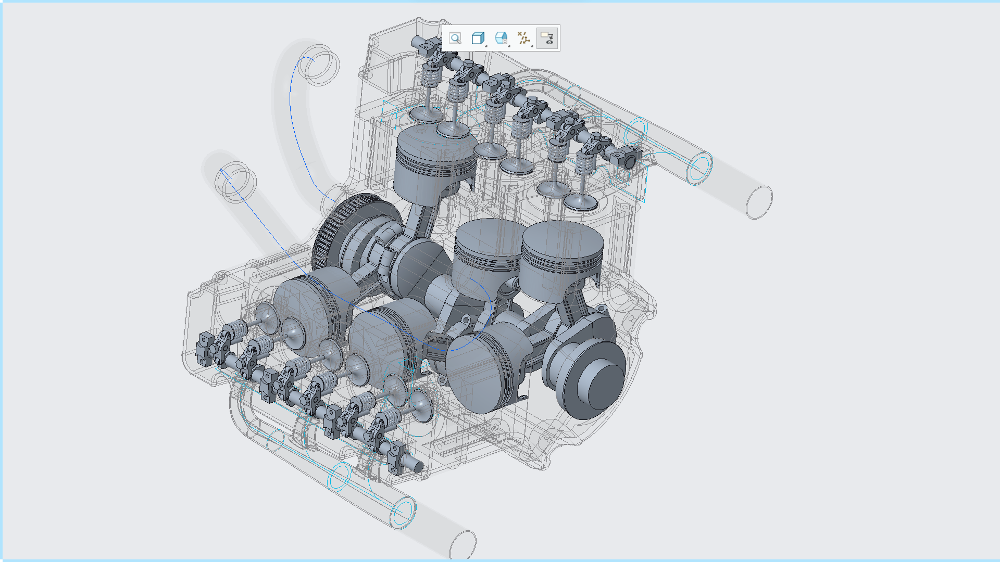
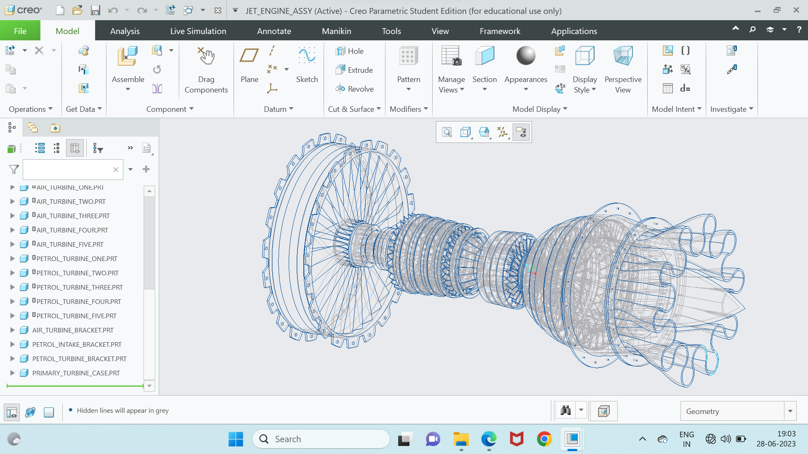
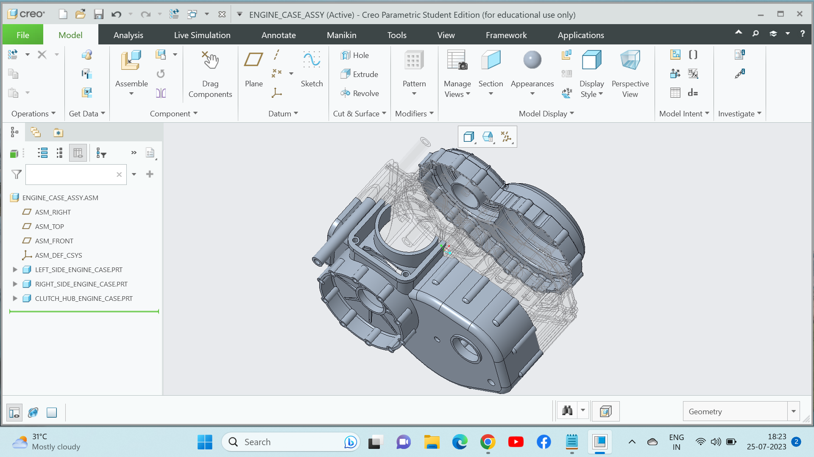
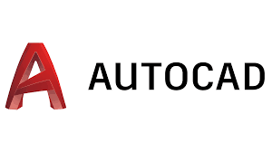
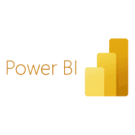
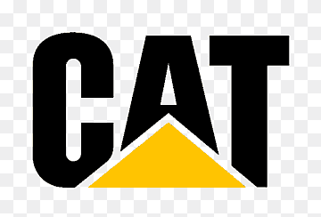

<!-- Header Banner -->

# Hi, I'm Satyam Kumar Singh!

**Mechanical Engineer | CAD Designer | Lab-Based Problem Solver**

"Hybrid" reflects the fusion of on-ground experience and Data analysis.

From turning spanner to turning data into actionable insights.

After years on the ground with heavy machines, I'm now in the lab — transforming hands-on experience into precise designs and deeper analysis.

---

### 🛠️ My Work in Action

#### 1. **Internal Combustion Engine**

> Complete engine assembly with pistons, crankshaft, and flywheel modeled and animated.

#### 2. **Jet Turbine**

> Designed a multi-stage jet turbine with aerodynamic blade profiles and realistic housing.

#### 3. **Motorcycle Engine**

> Motorcycle engine modeled in Creo showcasing detailed and compact, high-performance design.

---

### 🔍 Back in the Lab – What I'm Working On

- Proactively monitoring the equipement on the basis of EXCEPTION and EVENT.  
- ACE and Grafana is the weapon instead of hammer and chisel.  
- Merging **CAD + analytics** for smart understaing.

---

## Learning Roadmap

Currently upskilling with:
- **SQL for Data Management**
- **Power BI for Reporting**
- **Statistics & Excel VBA**

## Projects (Upcoming)
-Designed a SQL-based database to manage equipment maintenance logs. 

-Built an interactive Power BI dashboard for analyzing downtime, cost, and service trends.

-A complete 3D motorcycle 🏍️ model designed in PTC Creo, featuring frame, suspension, wheels, engine, and full assembly with rendering.

### ⚙️ Tools & Skills

      
              

---

### 📫 Connect with Me

 

 

---

> “Back to the lab, not to escape the field—but to understand it better.”

<!-- Footer GIF -->

  

