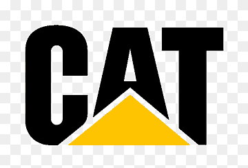

<!-- Header Banner -->

# Hi, I'm Satyam Kumar Singh!

**Mechanical Engineer | CAD Designer | Lab-Based Problem Solver**

After years on the ground with heavy machines, I'm now back in the lab — transforming hands-on experience into precise designs and deeper analysis.

---

### 🛠️ My Work in Action

#### 1. **Internal Combustion Engine**

> Complete engine assembly with pistons, crankshaft, and flywheel modeled and animated.

#### 2. **Jet Turbine**

> Designed a multi-stage jet turbine with aerodynamic blade profiles and realistic housing.

#### 3. **Motorcycle Engine**

> Lightweight yet strong frame designed for sport bikes using parametric modeling.

---

### 🔍 Back in the Lab – What I'm Working On

- Analyzing real field failures in a controlled lab setting  
- Building maintenance dashboards in **Power BI**  
- Creating equipment health databases using **SQL**  
- Merging **CAD + analytics** for smart design improvements

---

## Learning Roadmap

Currently upskilling with:
- **Python for Data Analysis**
- **SQL for Data Management**
- **Power BI for Reporting**
- **Statistics & Excel VBA**

## Projects (Upcoming)
-Designed a SQL-based database to manage equipment maintenance logs. 

-Built an interactive Power BI dashboard for analyzing downtime, cost, and service trends.

### ⚙️ Tools & Skills

 
   ---

### 📫 Connect with Me

  

---

> “Back to the lab, not to escape the field—but to understand it better.”

<!-- Footer GIF -->

  

